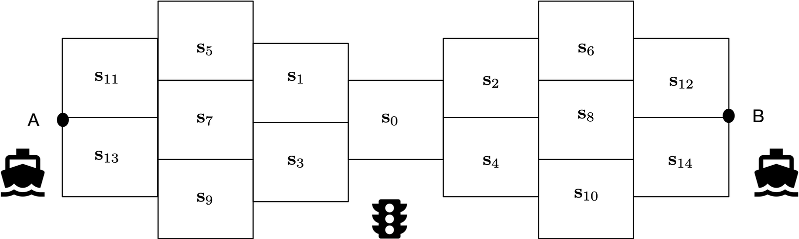
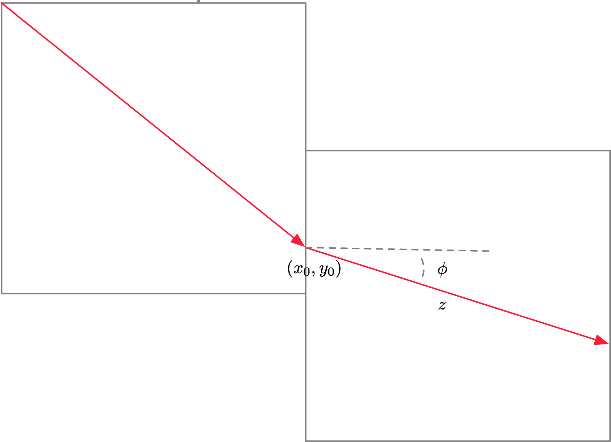

# Trabalho Prático 4

> O tema deste trabalho é a aplicação de técnicas de verificação de propriedades em sistemas dinâmicos discretos a sistemas ciber-físicos; nomeadamente a verificação de propriedades de segurança em autómatos híbridos e sistemas híbridos — como são descritos no Capítulo 5 do programa.

Pretende-se modelar o controle de tráfego marítimo num canal estreito entre dois portos, identificados como $A$ e $B$ e situados situados em cada um dos extremos do canal. O tráfego esta restrito a dois navios: um viajando na rota $\,A{\to}B\,$ e outro viajando na rota $\,B{\gets}A\,$.
O sistema híbrido é formado por quatro autómatos híbridos: os dois navios e um semáforo que controla o acesso de cada um dos navios aos diferentes sectores.
A sua descrição é baseada no seguinte mapa

- A geometria navegável do canal está organizada em 15 sectores enumerados $\,\mathbf{s}_0,...,\mathbf{s}_{14}\,$. Os sectores são todos quadrados com lado $\,1\, \mathsf{km}$ ; para identificar a posição de um navio dentro o sector $\,\mathsf{s}_i\,$ usa-se um referencial próprio $\,(x,y)\,$ com origem no canto inferior esquerdo.
- A condição de segurança suficiente pretende garantir que em qualquer dos sectores não podem estar simultaneamente os dois navios. A condição dita de segurança forte exige que, para além de de se verificar a condição de “segurança suficiente” se verifique também que nenhum dos navios é forçado a se imobilizar aguardando que o outro abandone o sector para onde pretende transitar.
- Os modos do semáforo são pares $\,(s_A,s_B)\,$ em que $\,s_A\,$ é o setor onde se encontra o navio saído do porto $A$ e $\,s_B\,$ é o setor onde se encontra o navio $\,B\,$. Os sinais do semáforo (vermelho, amarelo, verde) são os sincronismos (ou ausência deles) que esse semáforo faz com as transições de modo em cada um dos navios: “verde” corresponde a permissão de o navio transitar de sector, “amarelo” corresponde à autorização de transição do navio para o sector vizinho do sector onde está o outro navio, “vermelho” é não-sincronismo.
- A única variável contínua no semáforo é o tempo mestre $\,t\,$ que é incrementado com o sincronismo com as alterações de modo nos navios
- Os modos do navio são definidos pelos sectores $\,s\,$. A cada modo estão associados parâmetros racionais, constantes dentro de cada sector mas variando de sector para sector.
  - $\gamma > 0\,$ é a aceleração linear definida pela propulsão do navio
  - $\varepsilon\;$ é a força exercida pela corrente no canal que actua a favor ou contra a trajectória.
  - $\phi\,$ é o rumo do navio definido como o ângulo que a trajetória do movimento linear faz com o eixo horizontal.
  - $V\,$ é o limite superior na velocidade do navio.

> Na rota $\,A\to B\,$ os sectores $\{s_{11},s_{13}\}\,$ e $\{s_2,s_4\}\,$ são zonas de aceleração ($\,\gamma \simeq 1\,$); os sectores $\,\{s_1,s_3\}\,$ e $\,\{s_{12},s_{14}\}\,$ são zonas de desaceleração ($\,\gamma\simeq 0\,$); os sectores $\{s_5,s_7,s_9\}\,$ e $\{s_6,s_8,s_{10}\}\,$ são zonas de velocidade aproximadamente constante e de cruzeiro; finalmente $\,\{s_0\}\,$ é a zona de velocidade baixa aproximadamente constante.  Na rota $\,B\to A\,$ as zonas de aceleração e desaceleração aparecem trocadas. |

- Dentro de cada modo o movimento linear do navio é representado diretamente pelas variáveis contínuas tempo $\,\tau\geq 0\,$ , velocidade $\,\upsilon\geq 0\,$ e deslocamento $\,z\geq 0\,$. O movimento é regido pelas equações diferenciais
  $\left\{\begin{array}{lclcl} \dot{\upsilon} + \sigma\,\upsilon &=& \gamma &\text{se}& \upsilon\leq V \\ \dot{\upsilon} + \sigma\,\upsilon &=& \varepsilon  &\text{se}&\upsilon > V \\ \dot{z} &=& \upsilon \end{array}\right.$
  sendo $\sigma\,$ , o coeficiente de atrito com a àgua, uma constante positiva que é independente do modo mas depende do navio.
  As condições iniciais deste sistema de equações diferenciais são $z(0) = 0$ e $\upsilon(0)= \upsilon_0\,$ , sendo a constante $\,\upsilon_0\,$ a velocidade que transita do modo anterior.

> Assume-se que as diferenças de rumo em cada transição são suficientemente pequenas para não afectar significativamente o valor de $\,\upsilon_0\,$.

- A posição do navio, nas coordenadas de cada sector, é definida pelo par de coordenadas
  $x = x_0 + z\,\cos(\phi)\qquad$ e $\qquad y \equiv y_0 + z\,\sin(\phi)$
  sendo $(x_0,y_0)\,$ o ponto do sector onde a trajetória se inicia.
  O facto de a trajetória estar contida num quadrado de lado $\,1\,$ impõe as restrições
  $(0 \leq x_0 + z\,\cos(\phi) \leq 1)\,\land\,(0\leq y_0 + z\,\sin(\phi)\leq 1)$

Pretende-se:

1. Criar os três autómatos híbridos representando ambos os navios e o semáforo. Definir
   1. os modos/locais
   2. as variáveis de modo e as equações de fluxo para cada modo
   3. os “jumps” e “eventos” e os “switch” de cada “jump”; identificar os sincronismos entre os vários autómatos.
2. Construir o FOTS que representa o sistema híbrido global: identificar o predicado que descreve a condição de segurança.
3. Verificar, usando BMC ou $k$-indução, a segurança do sistema quer na versão suficiente como na versão forte.
